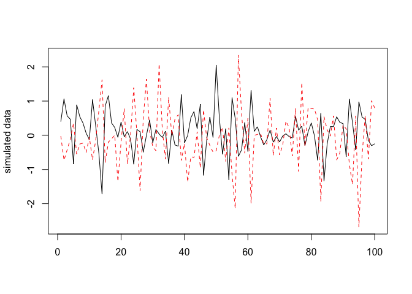
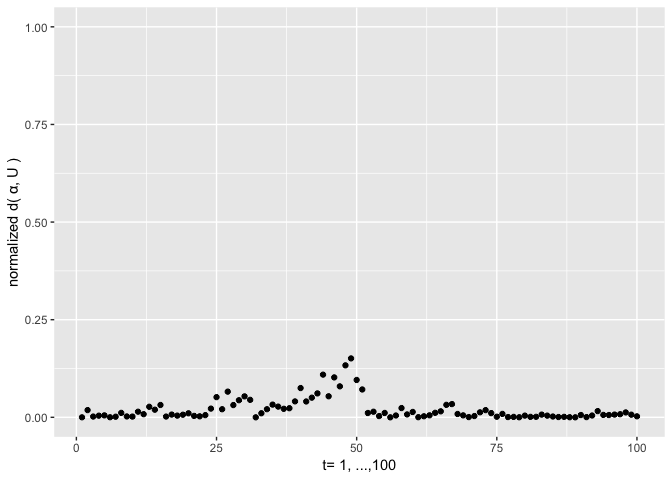
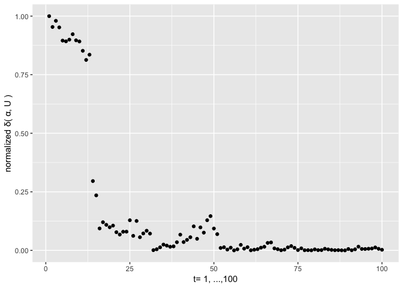
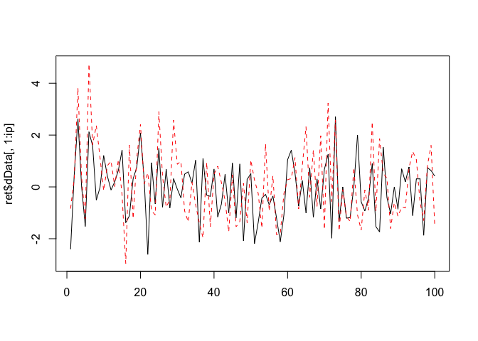
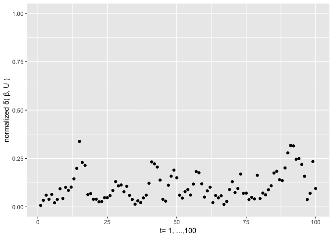
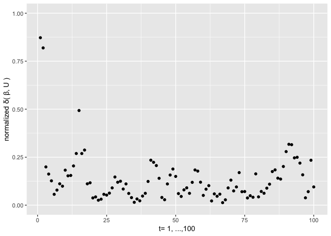

<!-- README.md is generated from README.Rmd. Please edit that file -->
SMFilter version 1.0.2 (Red Filter)
===================================

[](https://cran.r-project.org/package=SMFilter)   

The package implements the filtering algorithms for the state-space models on the Stiefel manifold. It also implements sampling algorithms for uniform, vector Langevin-Bingham and matrix Langevin-Bingham distributions on the Stiefel manifold. You can also find the package on CRAN, see

[SMFilter@CRAN](https://CRAN.R-project.org/package=SMFilter)

and the corresponding paper

[Yang, Y.; Bauwens, L. State-Space Models on the Stiefel Manifold with a New Approach to Nonlinear Filtering. *Econometrics* **2018**, 6, 48.](https://www.mdpi.com/2225-1146/6/4/48)

How to install
--------------

You can either install the stable version from CRAN

``` r
install.packages("SMFilter")
```

or install the development version from GitHub

``` r
devtools::install_github("yukai-yang/SMFilter")
```

provided that the package "devtools" has been installed beforehand.

Example
-------

After installing the package, you need to load (attach better say) it by running the code

``` r
library(SMFilter)
```

You can first check the information and the current version number by running

``` r
version()
#> SMFilter version 1.0.2 (Red Filter)
```

Then you can take a look at all the available functions and data in the package

``` r
ls( grep("SMFilter", search()) ) 
#> [1] "FDist2"       "FilterModel1" "FilterModel2" "rmLB_sm"     
#> [5] "runif_sm"     "rvlb_sm"      "SimModel1"    "SimModel2"   
#> [9] "version"
```

### Type one model

For details, see

``` r
?SimModel1
```

First we can use the package to sample from the type one model. To this end, we shall initialize by running

``` r
set.seed(1) # control the seed
iT = 100 # sample size
ip = 2 # dimension of the dependent variable
ir = 1 # rank number
iqx = 3 # dimension of the independent variable x_t
iqz=0 # dimension of the independent variable z_t
ik = 0 # lag length
method='max_3' # the optimization methond to use, for details, see FilterModel1
Omega = diag(ip)*.1 # covariance of the errors
vD = 50 # diagonal of the D matrix
```

Then we initialize the data and some other parameters

``` r
if(iqx==0) mX=NULL else mX = matrix(rnorm(iT*iqx),iT, iqx)
if(iqz==0) mZ=NULL else mZ = matrix(rnorm(iT*iqz),iT, iqz)
if(ik==0) mY=NULL else mY = matrix(0, ik, ip)
alpha_0 = matrix(c(runif_sm(num=1,ip=ip,ir=ir)), ip, ir)
beta = matrix(c(runif_sm(num=1,ip=ip*ik+iqx,ir=ir)), ip*ik+iqx, ir)
if(ip*ik+iqz==0) mB=NULL else mB = matrix(c(runif_sm(num=1,ip=(ip*ik+iqz)*ip,ir=1)), ip, ip*ik+iqz)
```

Then we can simulate from the model

``` r
ret = SimModel1(iT=iT, mX=mX, mZ=mZ, mY=mY, alpha_0=alpha_0, beta=beta, mB=mB, vD=vD, Omega=Omega)
```

Have a look at the simulated data

``` r
matplot(ret$dData[,1:ip], type="l", ylab="simulated data")
```



Then let's apply the filtering algorithm on the data

``` r
fil = FilterModel1(mY=as.matrix(ret$dData[,1:ip]), mX=mX, mZ=mZ, beta=beta, mB=mB, Omega=Omega, vD=vD, U0=alpha_0, method=method)
```

Then we compare the filtered modal orientations with the true ones in terms of the squared Frobenius norm distance (normalized).



What if we start with a wrongly specified initial value, −**α**<sub>0</sub> cannot be worse?



### Type two model

For details, see

``` r
?SimModel2
```

Again, we start with sampling. We initialize the parameters

``` r
iT = 100
ip = 2
ir = 1
iqx = 4
iqz=0
ik = 0
Omega = diag(ip)*.1
vD = 50
```

Then we initialize the data and some other parameters

``` r
if(iqx==0) mX=NULL else mX = matrix(rnorm(iT*iqx),iT, iqx)
if(iqz==0) mZ=NULL else mZ = matrix(rnorm(iT*iqz),iT, iqz)
if(ik==0) mY=NULL else mY = matrix(0, ik, ip)
alpha = matrix(c(runif_sm(num=1,ip=ip,ir=ir)), ip, ir)
beta_0 = matrix(c(runif_sm(num=1,ip=ip*ik+iqx,ir=ir)), ip*ik+iqx, ir)
if(ip*ik+iqz==0) mB=NULL else mB = matrix(c(runif_sm(num=1,ip=(ip*ik+iqz)*ip,ir=1)), ip, ip*ik+iqz)
```

Then we can simulate from the model

``` r
ret = SimModel2(iT=iT, mX=mX, mZ=mZ, mY=mY, alpha=alpha, beta_0=beta_0, mB=mB, vD=vD)
```

And then have a look at the simulated data

``` r
matplot(ret$dData[,1:ip], type="l",ylab="simulated data")
```



Apply the filtering algorithm on the data

``` r
fil = FilterModel2(mY=as.matrix(ret$dData[,1:ip]), mX=mX, mZ=mZ, alpha=alpha, mB=mB, Omega=Omega, vD=vD, U0=beta_0, method=method)
```

Then we compare the filtered modal orientations with the true ones in terms of the squared Frobenius norm distance (normalized).



What if we start with a wrongly specified initial value, −**β**<sub>0</sub> cannot be worse?


